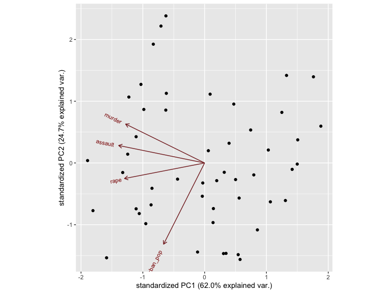
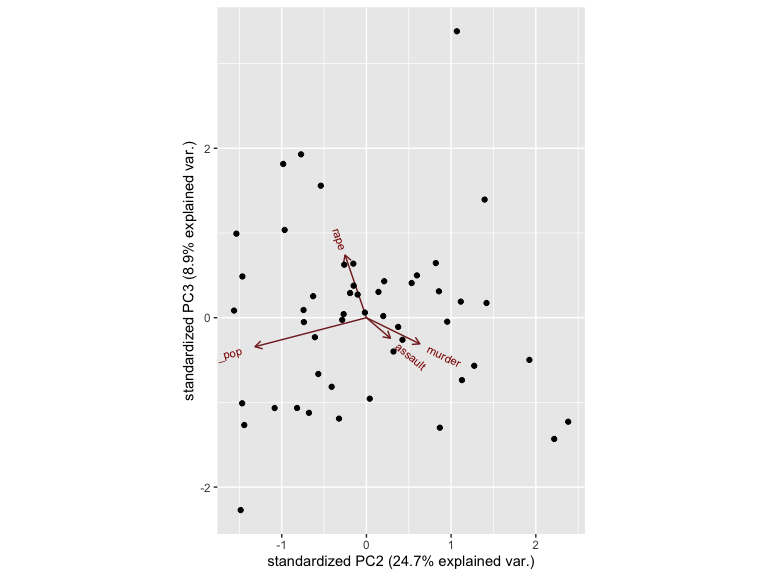
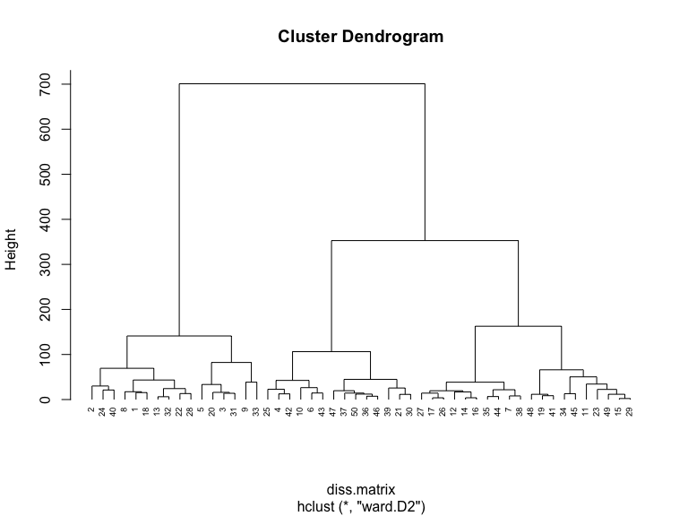
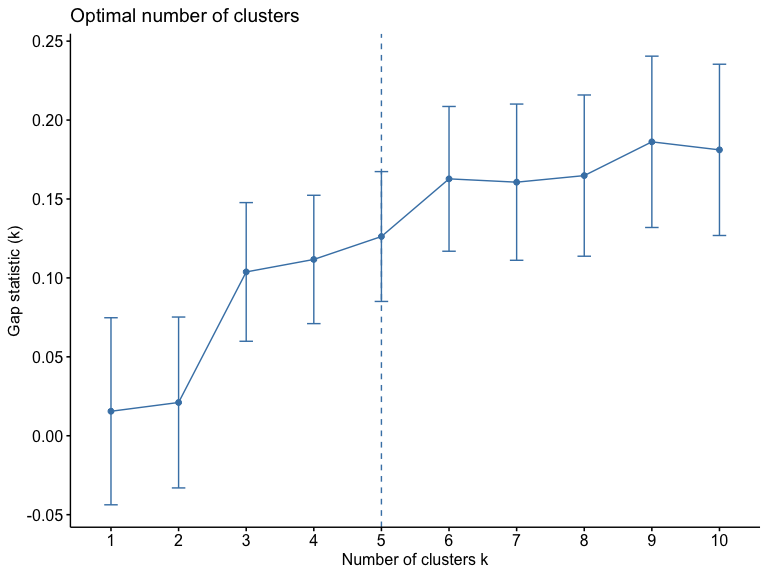

ml_hw4
================

# Part I: Implementing a Simple Prediction Pipeline

### Preprocessing

#### Tidying

Here we read-in the data, convert categorical variables to factors and
remove missing data

``` r
nycpat <-
    read_csv("data/class4_p1.csv") %>% 
    mutate(
        chronic1 = factor(chronic1),
        chronic3 = factor(chronic3),
        chronic4 = factor(chronic4),
        tobacco1 = factor(tobacco1),
        alcohol1 = factor(alcohol1),
        habits5 = factor(habits5),
        habits7 = factor(habits7),
        agegroup = factor(agegroup),
        dem3 = factor(dem3),
        dem4 = factor(dem4),
        dem8 = factor(dem8),
        povertygroup = factor(povertygroup)
    ) %>% 
    select(- ...1) %>% 
    drop_na()
```

    ## New names:
    ## Rows: 3811 Columns: 17
    ## ── Column specification
    ## ──────────────────────────────────────────────────────── Delimiter: "," dbl
    ## (17): ...1, chronic1, chronic3, chronic4, bmi, tobacco1, alcohol1, gpaq8...
    ## ℹ Use `spec()` to retrieve the full column specification for this data. ℹ
    ## Specify the column types or set `show_col_types = FALSE` to quiet this message.
    ## • `` -> `...1`

The New York City Department of Health general health and physical
activity has 2195 observations and 16 features. The variables
`chronic1`, `chronic3`, `chronic4`, `tobaco1`, `alcohol1`, `habits5`,
`habits7`, `agegroup`, `dem3`, `dem4`, `dem8`, `povertygroup`, and
`healthydays`are categorical variables but were read-in as continuous.
While the variables `bmi`, `gpaq11days`, `gpaq8totmin`, and
`healthydays` are continuous and were read-in correctly.

#### Finding correlations

Then we examine the data for feature with high correlations. No high
correlations was found.

``` r
cor_pat <-
    nycpat %>% 
    select(where(is.numeric)) %>% 
    cor(use = "complete.obs") %>% 
    findCorrelation(cutoff=0.4)
```

#### Creating balanced partitions in the data

Next we partition data into training and testing (use a 70/30 split)

``` r
set.seed(123)
train.index<-createDataPartition(nycpat$healthydays, p=0.7, list=FALSE)

pat_train<-nycpat[train.index,]
pat_test<-nycpat[-train.index,]
```

#### Building and fitting the model

Here we build two linear regression models on the training.

In model 1 we use: \* `chronic4`: asthma status \* `bmi`: body mass
index \* `alcohol1`: alcohol use status \* `agegroup`: age group \*
`dem3`: sex \* `dem4`: Hispanic or Latino \* `povertygroup`: poverty
status by household income

In model 2 we use: \* `chronic1`: hypertension status \* `chronic3`:
diabetes status \* `bmi`: body mass index \* `alcohol1`: alcohol use
status \* `agegroup`: age group \* `dem3`: sex \* `dem8`: birthplace in
US or outside \* `gpaq8totmin`: minutes/day doing activitiy \*
`gpaq11days` days active/week \* `povertygroup`: poverty status by
household income

``` r
set.seed(123)

regresscontrol <- trainControl(method ="repeatedcv", number = 10, repeats = 5)
                       
lm1 <- train(healthydays ~ chronic4 + bmi + alcohol1 + agegroup + dem3 + dem4 + povertygroup, data = pat_train, method = "lm", preProc=c("center", "scale"), trControl = regresscontrol)

lm2 <- train(healthydays ~ chronic1 + chronic3 + bmi + alcohol1 + gpaq8totmin + gpaq11days + agegroup + dem3 + dem8 + povertygroup, data = pat_train, method = "lm", preProc=c("center", "scale"), trControl = regresscontrol, metric = "RMSE")
```

#### evaluating performance

We evaluate the two models performance using test data based on the root
mean square error (RMSE) for each as an evaluation metric.

``` r
set.seed(123)
test_lm1 <- train(healthydays ~ chronic4 + bmi + alcohol1 + agegroup + dem3 + dem4 + povertygroup, data = pat_test, method = "lm", preProc=c("center", "scale"), trControl = regresscontrol)

test_lm2 <- train(healthydays ~ chronic1 + chronic3 + bmi + alcohol1 + gpaq8totmin + gpaq11days + agegroup + dem3 + dem8 + povertygroup, data = pat_test, method = "lm", preProc=c("center", "scale"), trControl = regresscontrol)

predictions1 <- predict(test_lm1, pat_test)
RMSE(predictions1, pat_test$healthydays)
```

    ## [1] 7.289053

``` r
predictions2 <- predict(test_lm2, pat_test)
RMSE(predictions2, pat_test$healthydays)
```

    ## [1] 7.268328

With a lower RMSE (7.27) model 2 performs slightly better compared to
model 1 (RMSE = 7.29) but the difference is insignificant. This model
could be used to evaluate where it may be best to allocate some
recreational and wellness resources like funding certain wellness
programs on community levels as well establishing preventive health
programs among New York City communities.

## Part II: Conducting an Unsupervised Analysis

Using the dataset from the Group assignment Part 3 (USArrests), identify
clusters using hierarchical analysis. Use an agglomerative algorithm for
hierarchical clustering. Use a Euclidian distance measure to construct
your dissimilarity matrix.

### Preprocessing

#### Tidying

``` r
data("USArrests")

usarrests <-
  USArrests %>% 
  as_tibble(USArrests) %>% 
    janitor::clean_names() %>% 
    drop_na() 

# checking if scaling is necessary
colMeans(usarrests)
```

    ##    murder   assault urban_pop      rape 
    ##     7.788   170.760    65.540    21.232

``` r
apply(usarrests, 2, sd)
```

    ##    murder   assault urban_pop      rape 
    ##  4.355510 83.337661 14.474763  9.366385

### Conduct Principle Component Analysis

``` r
set.seed(123)

usarrests.pca<-prcomp( ~., data=usarrests, center=TRUE, scale=TRUE)

#view results of pca
summary(usarrests.pca)
```

    ## Importance of components:
    ##                           PC1    PC2     PC3     PC4
    ## Standard deviation     1.5749 0.9949 0.59713 0.41645
    ## Proportion of Variance 0.6201 0.2474 0.08914 0.04336
    ## Cumulative Proportion  0.6201 0.8675 0.95664 1.00000

``` r
#Identify how features loaded on the different components
usarrests.pca$rotation
```

    ##                  PC1        PC2        PC3         PC4
    ## murder    -0.5358995  0.4181809 -0.3412327  0.64922780
    ## assault   -0.5831836  0.1879856 -0.2681484 -0.74340748
    ## urban_pop -0.2781909 -0.8728062 -0.3780158  0.13387773
    ## rape      -0.5434321 -0.1673186  0.8177779  0.08902432

``` r
ggbiplot(usarrests.pca)
```



``` r
ggbiplot(usarrests.pca, choices=c(2,3))
```



Conduct a hierarchical clustering analysis. Be sure to specify the
linkage method used. Within your analysis, make sure you do both of the
following:

``` r
set.seed(123)
# Create Dissimilarity matrix
diss.matrix <- dist(usarrests, method = "euclidean")

# Hierarchical clustering using Complete Linkage
clusters.h<- hclust(diss.matrix, method = "ward.D2" )

# Plot the obtained dendrogram
plot(clusters.h, cex = 0.6, hang = -1)
```



``` r
gap_stat <- clusGap(usarrests, FUN = hcut, nstart = 25, K.max = 10, B = 50)
fviz_gap_stat(gap_stat)
```



Optimal number of clusters is 5 as confirm by plotting the gap statistic

Describe the composition of each cluster in terms of the original input
features

Pretend that the data are from 2020 and not 1973. Describe one research
question that can be addressed using the newly identified clusters.

Briefly comment on any scientific or ethical considerations one should
review before using these clusters for your specific question. NOTE: The
clusters can be used as an exposure, an outcome or a covariate.
